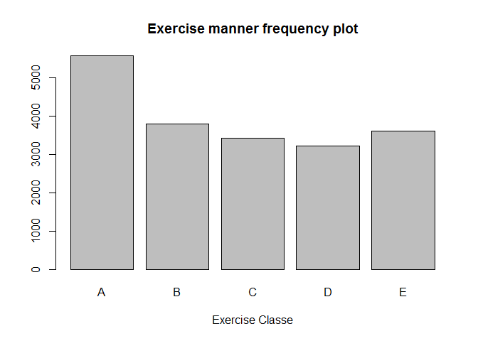

# Exercise Accelerometer Analysis: Predicting exercise manner
### Analysis by Tim Richer
######(for Practical Machine Learning Course Project)
### Executive Summary
####Devices collect a large amount of data about personal activity. Using accelerometer data collected, while the user is engaged in a particular activity, it is possible to quantify how well they do the activity.  Using data, collected from the accelerometers on the belt, forearm, arm, and dumbell of 6 participants, we can predict the manner in which they did the exercise.
* Activity "classe": 
    + Class A:exactly according to the specification 
    + Class B:throwing the elbows to the front 
    + Class C:lifting the dumbbell only halfway 
    + Class D:lowering the dumbbell only halfway 
    + Class E:throwing the hips to the front

####  Applying machine learning algorithms we are able to determine a model which had the highest accuracy and lowest error rate.  Boosting and Random Forests are the most common tools in prediction contests so those models were evaluated first.  The focus of the model selection was accuracy.  Random Forest offered greater accuracy so that model was selected.  The analysis describes how the model was built, the use of cross validation, and the expected in-sample and out-of-sample errors.  The Random Forest model led to the greatest accuracy, with an in-sample accuracy of 100% and an out-of-sample accuracy of 99.16%.  The model was then used to predict 20 different test cases.    When the model was used with the Validation dataset it resulted in the following 'classe' predicitons for the 20 datasets:"B" "A" "B" "A" "A" "E" "D" "B" "A" "A" "B" "C" "B" "A" "E" "E" "A" "B" "B" "B".

### Exploring and Cleaning the data

####An initial review of that datasets indicated a high occurence of columns with no data.  If more than half of the observations for a column were NA then the column was excluded.  This eliminated 100 predictors.  The corresponding columns were then removed from the validation dataset as well.


```r
#Load the required libraries
library(knitr)
library(lattice)
library(ggplot2)
library(caret)
library(survival)
library(splines)
library(parallel)
library(plyr)
library(gbm)
library(randomForest)
```


```r
#Download the exercise datasets.
pml_training_URL <- "https://d396qusza40orc.cloudfront.net/predmachlearn/pml-training.csv"
pml_testing_URL <-"https://d396qusza40orc.cloudfront.net/predmachlearn/pml-testing.csv"
download.file(pml_training_URL, "pml-training.csv")
download.file(pml_testing_URL, "pml-testing.csv")

# load the training and testing datasets
training_file <- read.csv("pml-training.csv", header = TRUE, na.strings= c("", "NA"))
validation_file <- read.csv("pml-testing.csv", header = TRUE, na.strings= c("", "NA"))

#If the number of NA values exceeds 50% exclude the column
total_column_count <- ncol(training_file)
empty_columns <- (colSums(is.na(training_file)) > (nrow(training_file)/2))
empty_column_count = ncol(training_file[empty_columns])

print(paste0("Total columns (initially): ", total_column_count))
```

```
## [1] "Total columns (initially): 160"
```

```r
print(paste0("Empty columns: ", empty_column_count))
```

```
## [1] "Empty columns: 100"
```

```r
#Get rid of the empty columns in the dataset.
training_data <- training_file[!empty_columns]
validation_data <- validation_file[!empty_columns]
```
####Of the remaining columns, the next step was to eliminate predictors not related to the accelerometer.  Using like data to predict like led to removal of 7 additional columns of unrelated data: an index, user_name, 3 timestamps, and 2 window observations. This left 52 accelerometer predictors, and the variable, classe, which we are trying to predict.

```r
#Get rid of columns not related to accelerometer data.
non_accelerometer_data <- c(1:7)
training_data <- training_data[, -non_accelerometer_data]
validation_data <- validation_data[, -non_accelerometer_data]
```
####With the data cleaned up, we can explore the predictors.  As we can see in the summary and frequency plot, Class A has the highest frequency, followed by the rest which all have similar frequencies

```r
summary(training_data$classe)
```

```
##    A    B    C    D    E 
## 5580 3797 3422 3216 3607
```

Figure 1
 

###Analysis:
#### Model Selection: With a focus on accuracy, Random Forest and Boosting models were created to determine a model selection.  The training dataset was partitioned into a 60% training and a 40% testing split, and we also have a validation dataset for the prediction test.  Cross Validation was used, 3 fold, a smaller k was used so there would be less variance.   This split the training dataset into 3-subsets. Each subset is held out while the model is trained on all other subsets. This process is completed until accuracy is determined for each instance in the dataset, and an overall accuracy estimate is provided.  The accuracy for Random Forest was 98.6%.  The accuracy for Boosting was 95.8%.  Random Forest will be used for prediction because of it's higher accuracy.

```r
set.seed(998)
inTrain <- createDataPartition(y=training_data$classe, p=0.6, list=FALSE)
trainingdata <- training_data[inTrain,]
testingdata <- training_data[-inTrain,]

rf_model <- train(trainingdata$classe ~ ., data = trainingdata, method = "rf", prox = TRUE, trControl = trainControl(method = "cv", number =3, allowParallel = TRUE))

print(rf_model)
```

```
## Random Forest 
## 
## 11776 samples
##    52 predictor
##     5 classes: 'A', 'B', 'C', 'D', 'E' 
## 
## No pre-processing
## Resampling: Cross-Validated (3 fold) 
## Summary of sample sizes: 7851, 7851, 7850 
## Resampling results across tuning parameters:
## 
##   mtry  Accuracy   Kappa      Accuracy SD   Kappa SD   
##    2    0.9862432  0.9825968  0.0008815265  0.001112999
##   27    0.9863283  0.9827042  0.0025628047  0.003244466
##   52    0.9783463  0.9726027  0.0054188367  0.006859349
## 
## Accuracy was used to select the optimal model using  the largest value.
## The final value used for the model was mtry = 27.
```

```r
boosting_model <- train(trainingdata$classe ~ ., data = trainingdata, method = "gbm", verbose = FALSE, trControl=trainControl(method="cv", number =3, allowParallel = TRUE))

print(boosting_model)
```

```
## Stochastic Gradient Boosting 
## 
## 11776 samples
##    52 predictor
##     5 classes: 'A', 'B', 'C', 'D', 'E' 
## 
## No pre-processing
## Resampling: Cross-Validated (3 fold) 
## Summary of sample sizes: 7850, 7850, 7852 
## Resampling results across tuning parameters:
## 
##   interaction.depth  n.trees  Accuracy   Kappa      Accuracy SD
##   1                   50      0.7544132  0.6885647  0.015094471
##   1                  100      0.8222650  0.7750395  0.003760345
##   1                  150      0.8541939  0.8155327  0.005388552
##   2                   50      0.8452772  0.8039287  0.007213349
##   2                  100      0.9034464  0.8778080  0.006821667
##   2                  150      0.9277333  0.9085626  0.006534554
##   3                   50      0.8966530  0.8691776  0.007600425
##   3                  100      0.9374137  0.9208059  0.008602953
##   3                  150      0.9584746  0.9474659  0.006431717
##   Kappa SD   
##   0.019241945
##   0.004615105
##   0.006818601
##   0.009131669
##   0.008589878
##   0.008231579
##   0.009637495
##   0.010880134
##   0.008140093
## 
## Tuning parameter 'shrinkage' was held constant at a value of 0.1
## 
## Tuning parameter 'n.minobsinnode' was held constant at a value of 10
## Accuracy was used to select the optimal model using  the largest value.
## The final values used for the model were n.trees = 150,
##  interaction.depth = 3, shrinkage = 0.1 and n.minobsinnode = 10.
```
### Prediction:
####In-sample accuracy, from the training dataset:  The accuracy for Random Forest was 100%.

```r
training_prediction <- predict(rf_model, trainingdata)
confusionMatrix(training_prediction, trainingdata$classe)
```

```
## Confusion Matrix and Statistics
## 
##           Reference
## Prediction    A    B    C    D    E
##          A 3348    0    0    0    0
##          B    0 2279    0    0    0
##          C    0    0 2054    0    0
##          D    0    0    0 1930    0
##          E    0    0    0    0 2165
## 
## Overall Statistics
##                                      
##                Accuracy : 1          
##                  95% CI : (0.9997, 1)
##     No Information Rate : 0.2843     
##     P-Value [Acc > NIR] : < 2.2e-16  
##                                      
##                   Kappa : 1          
##  Mcnemar's Test P-Value : NA         
## 
## Statistics by Class:
## 
##                      Class: A Class: B Class: C Class: D Class: E
## Sensitivity            1.0000   1.0000   1.0000   1.0000   1.0000
## Specificity            1.0000   1.0000   1.0000   1.0000   1.0000
## Pos Pred Value         1.0000   1.0000   1.0000   1.0000   1.0000
## Neg Pred Value         1.0000   1.0000   1.0000   1.0000   1.0000
## Prevalence             0.2843   0.1935   0.1744   0.1639   0.1838
## Detection Rate         0.2843   0.1935   0.1744   0.1639   0.1838
## Detection Prevalence   0.2843   0.1935   0.1744   0.1639   0.1838
## Balanced Accuracy      1.0000   1.0000   1.0000   1.0000   1.0000
```

####Out-of-sample accuracy, from the testing dataset:  The accuracy for Random Forest was 99.16%

```r
testing_prediction <- predict(rf_model, testingdata)
confusionMatrix(testing_prediction, testingdata$classe)
```

```
## Confusion Matrix and Statistics
## 
##           Reference
## Prediction    A    B    C    D    E
##          A 2228    8    0    1    0
##          B    2 1504    9    1    0
##          C    1    6 1356   20    5
##          D    0    0    3 1263    8
##          E    1    0    0    1 1429
## 
## Overall Statistics
##                                           
##                Accuracy : 0.9916          
##                  95% CI : (0.9893, 0.9935)
##     No Information Rate : 0.2845          
##     P-Value [Acc > NIR] : < 2.2e-16       
##                                           
##                   Kappa : 0.9894          
##  Mcnemar's Test P-Value : NA              
## 
## Statistics by Class:
## 
##                      Class: A Class: B Class: C Class: D Class: E
## Sensitivity            0.9982   0.9908   0.9912   0.9821   0.9910
## Specificity            0.9984   0.9981   0.9951   0.9983   0.9997
## Pos Pred Value         0.9960   0.9921   0.9769   0.9914   0.9986
## Neg Pred Value         0.9993   0.9978   0.9981   0.9965   0.9980
## Prevalence             0.2845   0.1935   0.1744   0.1639   0.1838
## Detection Rate         0.2840   0.1917   0.1728   0.1610   0.1821
## Detection Prevalence   0.2851   0.1932   0.1769   0.1624   0.1824
## Balanced Accuracy      0.9983   0.9944   0.9931   0.9902   0.9953
```

### Prediction Assignment:  
####The predicition assignment was performed on the validation dataset.  The problem_id column was excluded since it was not relevant to the prediction.  It resulted in the following classe predicitons for the 20 datasets:"B" "A" "B" "A" "A" "E" "D" "B" "A" "A" "B" "C" "B" "A" "E" "E" "A" "B" "B" "B"


```r
#The Validation_file has the problem_id column, need to exclude.
validation_data_trim <- validation_data[,-53]
validation_prediction <- predict(rf_model, validation_data_trim)

validation_results <- as.character(validation_prediction)
validation_results
```

```
##  [1] "B" "A" "B" "A" "A" "E" "D" "B" "A" "A" "B" "C" "B" "A" "E" "E" "A"
## [18] "B" "B" "B"
```

```r
#Write out the answers:
for (i in 1:length(validation_data[,53])){
  quiz_file = paste("problem_id_", i, ".txt")
  write.table(validation_results[i], file=quiz_file, quote=FALSE, row.names=FALSE, col.names=FALSE)
}
```

###Conclusions
####In conclusion, the random forest machine learning model provided excellent accuracy and out-of-sample performance.  We used 3-fold cross validation, for greater robustness, which resulted in a 100% in-sample accuracy and a 99.16% out-of-sample accuracy.
