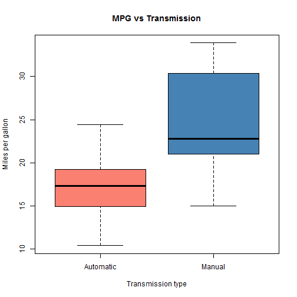

<h2>My Shiny App lets you choose different factors to include in a linear model.</h2>
<h3>The linear model shows the impact of the factor on miles per gallon.</h3>
<h3>The plot renders the residuals versus the fitted values. </h3>

<b>The mtcars dataset has a number of factors that impact mpg:</b>  
<b>cyl</b>   - Number of Cylinders in the Engine   
<b>disp</b>  - Displacement of the Engine (cu.in.)  
<b>hp</b>    - Gross Horsepower  
<b>drat</b>  - Rear Axil Ratio  
<b>wt</b>    - Weight (lb/1000)  
<b>qsec</b>  - Time in the Quarter Mile  
<b>v/s</b>   - V/S  
<b>am</b>    - Transmission (0=Automatic, 1=Manual)  
<b>gear</b>  - Number of Gears  
<b>carb</b>  - Number of Carburators  

--- .class #id 

For citizen data scientists, <b>that are just becoming familiar with the power of R </b>, 
My Shiny App lets them interactively explore factors, in the mtcars dataset, that impact mpg. 
The app allows many factors to be simultaneously considered, not just one at a time.  
Like the graph below:  

--- .class #id 

The plots rendering the residuals versus the fitted values, like the graphs below,  
allow for interesting interaction when different factors are included.  
This was the genesis of My Shiny App.  

--- .class #id 

My Shiny App lets you choose different factors to include in a linear model.
The linear model shows the impact of the factor(s) on miles per gallon.

## Shiny Application and Source

Shiny App Link:
https://timricherjhu.shinyapps.io/MyProject/

Link to GitHib Shiny Source code:
https://github.com/TimRicher/Data_Products

